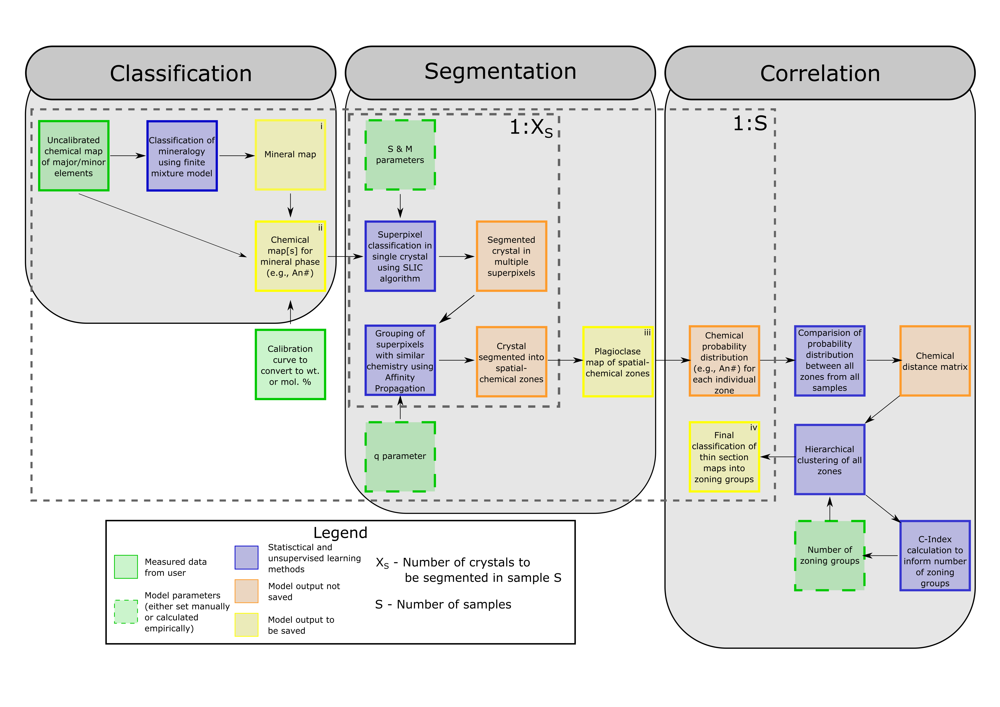

# Classification, Segementation, and Correlation (CSC) of zoned minerals

This resposity contains the following subfolders related to the CSC methodology published in Sheldrake & Higgins (2021) and Higgins & Sheldrake (2024): 
1. CODES - This contains version 1 and 2 of the CSC Code
2. DATA - This contains all data used in either the EXAMPLES or PUBLICATIONS folder
3. EXAMPLES - This contains an example a setp through guide of the latest version of the code
4. PUBLICATIONS - This contains output data (yellow blocks in figure below) for published articles

A general schema (above) for the Classification, Segmentation and Correlation (CSC) algorithm, based upon the methodology set out in Sheldrake & Higgins (2021) [version 1] and updated in Higgins & Sheldrake (2024) [version 2]. The Classification step categorises the phase minerology in each thin section, with the outputs being: (i) a map (.tif format) of the mineral phases; and (ii) a table (.csv format) summarising the composition of each plagioclase pixel. The input data used in this step are elemental maps (e.g. EDS or WDS counts measured by EPMA) and, if required by the user, a calibration relating counts wt. % or mol. %. The Segmentation step identifies the chemical zoning present in each crystal, with the output being an image (.tif format) of zoned crystals and accompanying reference table (.csv format) with the names of each zone. The input data for this step are the summary table produced in the Classification step. In Higgins & Sheldrake (2024), parameters (S, M, and q) for both the SLIC and Affinity Propagation algorithms have been updated from the version in Sheldrake & Higgins (2021), with more information found in the readme file contained in the CODES subfolder. These parameters, can also be chosen manually if required. The Correlation step correlates the chemical distribution between all zones in all thin sections, with the output being a map (.tif format) for each thin section, and a summary table (.csv format) for all crystal pixels. The input data for each thin section in the correlation step are: (i) the zonation maps and summary tables from the Segmentation step; and (ii) the table summarising each crystal pixel from the classification step. Additionally, user input is required to choose the final number of zoning groups across all samples.

<ins>References:</ins> 
Higgins, O., & Sheldrake, T., (2024). Identifying distinct pre-eruptive composition-H2O-time trends using plagioclase. Geochemistry, Geophysics, Geosystems. 
Sheldrake, T., & Higgins, O. (2021). Classification, segmentation and correlation of zoned minerals. Computers & Geosciences, 156, 104876.
